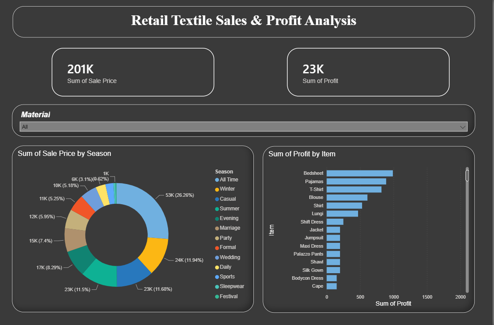
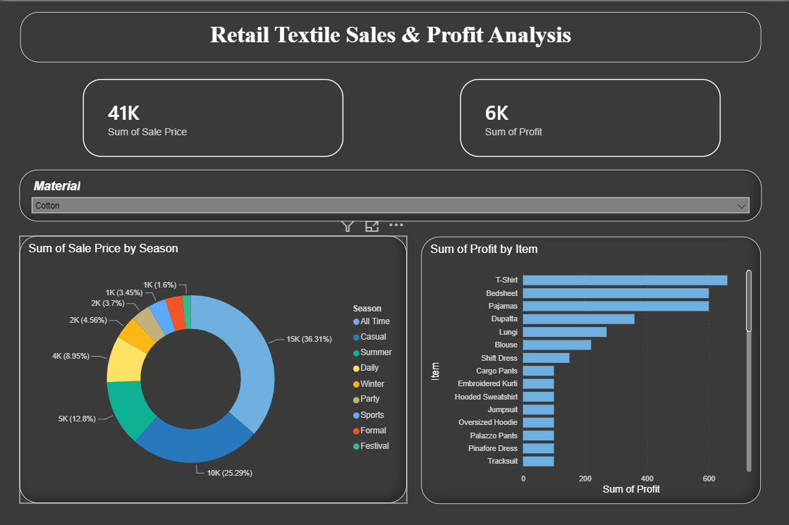
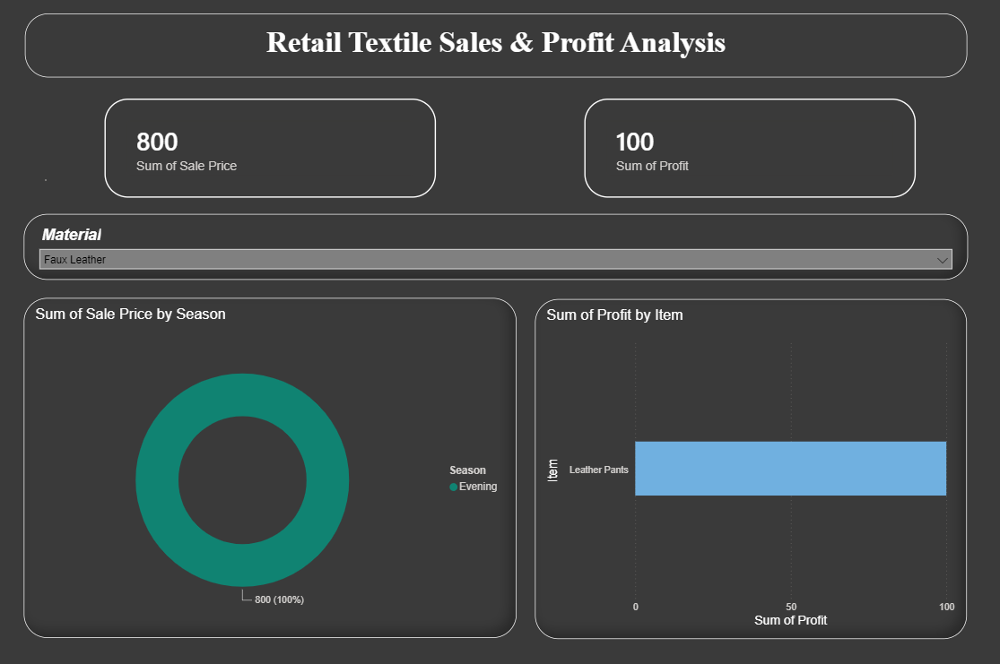

# Retail Textile Sales & Profitability Analysis 📊

##  Overview
This project features an interactive, end-to-end Business Intelligence dashboard built with Power BI. It analyzes seasonal retail textile sales, extracting actionable business insights on profitability, seasonal demand, and material performance to drive data-informed decision-making.

### 🔍 Dynamic Interactivity (Slicers in Action)
The dashboard features cross-filtering capabilities. Here is how the KPIs and charts dynamically update when users interact with specific filters:

*(Note: The following screenshots are just examples demonstrating the dashboard's interactivity. You can explore and filter by any available material, season, or category in the live `.pbix` file).*

**1. Filtered by Material (Cotton):**

**2. Filtered by Material (Faux Leather):**

##  Tech Stack & Skills
* **Tool:** Power BI Desktop
* **Data Processing:** Power Query (Data extraction, cleaning, text formatting, and handling null values)
* **Calculations:** DAX (Data Analysis Expressions) for custom metric generation (e.g., calculated Profit columns).
* **UI/UX Design:** Engineered a clean, high-contrast dark-themed layout with rounded borders for a modern, intuitive, and distraction-free user experience.

##  Key Business Insights
Based on the dashboard visualizations, the following trends were identified:
* **Overall Performance:** Tracked a total sales volume of **201K** with a net profit of **23K** across the analyzed dataset.
* **Top Profit Drivers:** Item-wise performance analysis revealed that **Sarees, Skirts, and Dupattas** consistently generate the highest profit margins compared to casual wear.
* **Seasonal Demand:** Evaluated sales distribution across various seasons to identify peak purchasing trends.
* **Dynamic Interactivity:** Implemented cross-filtering slicers (e.g., isolating data for specific materials like *Chiffon*) to allow stakeholders to drill down into specific inventory categories instantly and observe targeted KPIs.

##  Repository Contents
* `Retail_Textile_Sales_Analysis.pbix`: The complete, interactive Power BI project file.
* `Dashboard_Presentation.pdf`: A high-quality PDF export of the dashboard for quick viewing.
* `Dataset`: The base textile sales and inventory data used for this analysis.

##  How to View
1. Download the `.pdf` file for a quick visual overview of the dashboard design and charts.
2. To interact with the data and slicers, download the `.pbix` file and open it using **Power BI Desktop**.
